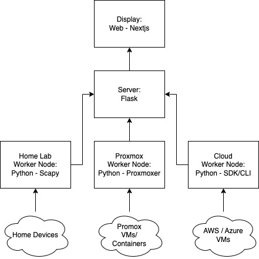

## 💡 About

> It is a work in progress

This is a tool to view hosts for my home server/lab.  

The goal is to see what virtual machines, devices and self hosted services I have running from a dashboard across vlans. I segmented my home network for testing, developing and trying things out. Monitoring cloud resources I have as well.

I used:
- [Next.js](https://nextjs.org/) - React Framework
- [shadcn/ui](https://ui.shadcn.com/) - Component Library

## :clipboard: Project Information

- This was built with Javascript using the frontend framework Next.js.  
- My first project using Next.js.
- Live demo is in the works
- The link to my portfolio/website [edelzamora.tech](https://www.edelzamora.tech/)

Inspired by and referenced [Youtube: The Best UI Components that EVERYONE is Using!](https://youtu.be/DTGRIaAJYIo?si=MzIh-S0qyIrfZMAp) for some of the UI

## Architecture / Diagram

